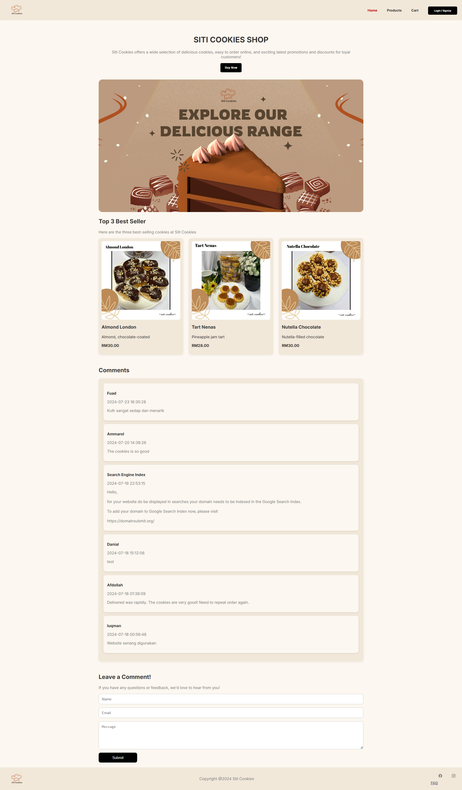
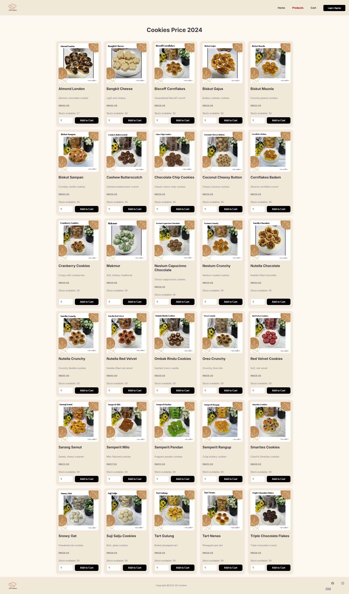
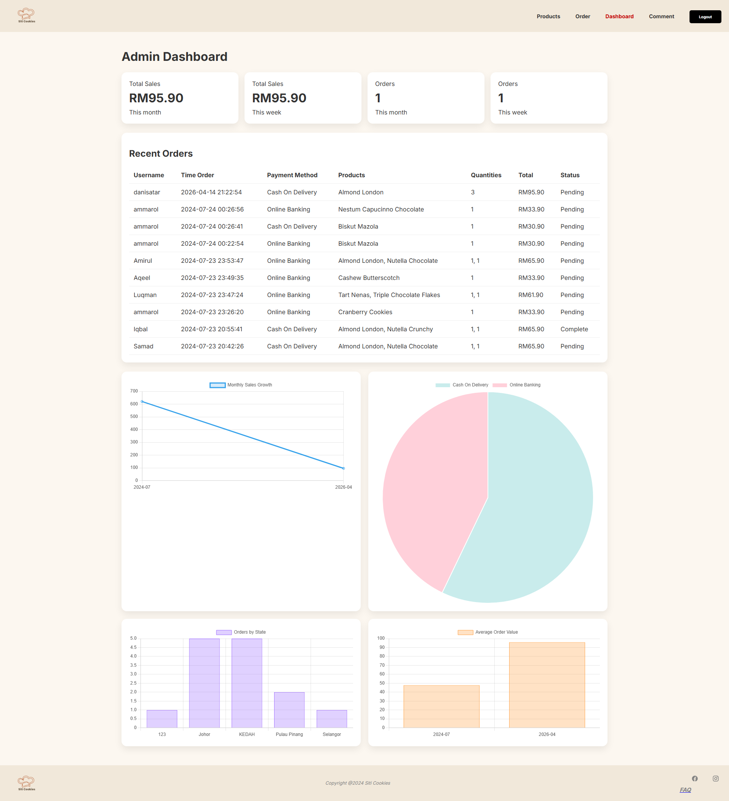
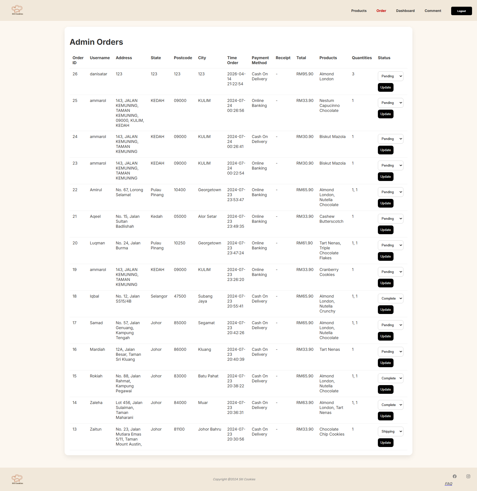

# 🍪 SitiCookiesFYP
A web-based cookie ordering system built using **Laravel 11** & MySQL for Final Year Project (FYP).

---

## 🚀 Overview
SitiCookiesFYP is a simple e-commerce system developed as a Final Year Project (FYP).  
The system simulates an online ordering platform where customers can browse products, place orders, and upload payment proof, while admins can manage products, orders, and view sales performance.

---

## ⭐ Features (Updated)

### 👤 Customer
- User registration and login
- Browse products
- Add to cart
- Checkout with Cash On Delivery or Online Banking
- Upload payment receipt
- View profile and update password
- Leave comments

### 🔧 Admin
- Manage products (Add, Update, Delete)
- View and update order status
- Sales dashboard (Chart.js)
- View customer comments

---

## 🛠️ Tech Stack
- PHP 8.2+
- Laravel 11
- MySQL
- Tailwind CSS / Bootstrap
- JavaScript (Alpine.js / Vue.js optional)
- XAMPP (Apache & MySQL)
- Chart.js (CDN)

---

## 📸 Screenshots
*(Add screenshots here)*

## 🔐 Default Admin Account
Username: SitiAdmin
Password: sitiadmin123

## 🚀 How to Run

1. Clone the repository and navigate to the folder.
2. Run `composer install`.
3. Copy `.env.example` to `.env` and configure your database (`siticookies`).
4. Run `php artisan key:generate`.
5. Run `php artisan migrate --seed` (to create tables and default admin).
6. Run `php artisan serve`.
7. Open in browser: http://127.0.0.1:8000

## 📌 Future Improvements
-Add database .sql file
-Improve system security
-Add order history feature
-Improve UI/UX design

## 📸 Screenshots

### 🏠 Homepage

### 🛍️ Product Page

### 📊 Admin Dashboard

### 📦 Admin Orders

